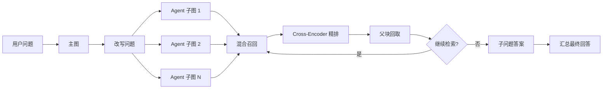

<div align="center">

# 多轮 Agentic RAG 企业文档智能问答系统

一个面向学习和作品集展示的 Agentic RAG 项目：用 LangGraph 手写主图与 Agent 子图，完成问题改写、并行检索、上下文管理、答案生成和 Ragas 评测。

[](https://www.python.org/)
[](https://langchain-ai.github.io/langgraph/)
[](https://docs.ragas.io/)
[](https://github.com/LiJiatuhly/Multi-turn-Agentic-RAG-Intelligent-Question-Answering-for-Enterprise-Documents)

</div>

## 项目简介

这个项目用于理解一个 Agentic RAG 的完整链路，而不是把所有功能封装成黑盒：

```text
用户问题 → 问题改写 → 子问题并行分发 → 混合检索 → reranker 精排
        → 父块回取 → Agent 判断是否继续检索 → 汇总回答 → Ragas 评测
```

系统基于智谱 OpenAI 兼容接口，使用 Gradio 提供交互界面。完整的源码职责、运行顺序和评测解释见 [RAG_SYSTEM_GUIDE.md](./RAG_SYSTEM_GUIDE.md)。

## 核心能力

| 模块 | 实现 | 解决的问题 |
| --- | --- | --- |
| 双层状态图 | LangGraph 主图 + Agent 子图 | 分离多轮对话管理和单个子问题的检索循环 |
| 并行子问题 | `Send` Fan-out / Fan-in | 复合问题拆解后并行处理，再合成最终回答 |
| 混合召回 | Qdrant 稠密向量 + FastEmbed BM25 + RRF | 同时利用语义匹配和关键词匹配 |
| 二阶段检索 | Cross-Encoder reranker | 从召回候选中重新选择最相关的文本块 |
| 父子分块 | 子块检索 + `parent_id` 回取父块 | 兼顾匹配精度和回答上下文完整性 |
| Agent 护栏 | 迭代次数、工具调用次数、fallback | 防止无效循环和无上下文回答 |
| 可解释评测 | Ragas + Agent 行为轨迹 | 同时评价回答质量、检索质量和 Agent 行为 |

## 架构概览



### 检索链路

```text
问题
  → Qdrant 召回最多 20 个候选子块
  → RRF 融合稠密向量和 BM25 结果
  → jinaai/jina-reranker-v2-base-multilingual 精排
  → 保留 top 7 子块
  → 根据 parent_id 回取完整父块
  → Agent 基于上下文判断和作答
```

## 快速开始

### 1. 安装项目依赖

```powershell
git clone https://github.com/LiJiatuhly/Multi-turn-Agentic-RAG-Intelligent-Question-Answering-for-Enterprise-Documents.git
cd Multi-turn-Agentic-RAG-Intelligent-Question-Answering-for-Enterprise-Documents
python -m venv venv
.\venv\Scripts\Activate.ps1
pip install -r requirements.txt
```

### 2. 配置模型

复制配置模板：

```powershell
Copy-Item project\.env.example project\.env
```

然后编辑 `project/.env`，至少填写：

```env
API_KEY=你的智谱APIKey
BASE_URL=https://open.bigmodel.cn/api/paas/v4/
MODEL_ID=glm-4.5-air
```

不要把 `project/.env` 提交到 GitHub。

### 3. 准备文档并启动

将自己的 Markdown 文档放入 `markdown_docs/`，然后运行：

```powershell
python project\app.py
```

打开终端提示的 Gradio 地址，开始提问。首次运行会建立本地 Qdrant 集合，并按需下载 reranker 模型。

## Ragas 评测

评测分为两个环境：项目环境负责生成真实回答，独立评测环境负责调用 Ragas 裁判模型。

```powershell
# 创建评测环境
python -m venv .venv-eval
.\.venv-eval\Scripts\Activate.ps1
pip install -r evaluation\requirements-eval.txt
```

评测顺序：

```powershell
# 1. 生成候选测试集（可先用 --size 5）
python evaluation\gen_testset.py --size 10

# 2. 打开 CSV，人工填写“保留”列为 是/否
code evaluation\artifacts\testset_preview.csv

# 3. 生成正式测试集
python evaluation\curate_testset.py

# 4. 切回项目环境，调用真实 Agent
deactivate
.\venv\Scripts\Activate.ps1
python evaluation\run_rag.py --limit 1
python evaluation\run_rag.py

# 5. 切回评测环境，评价最终回答
deactivate
.\.venv-eval\Scripts\Activate.ps1
python evaluation\score.py --scope turn
```

整轮级评测固定使用四个指标：

- `faithfulness`：回答是否忠于检索原文
- `answer_relevancy`：回答是否真正针对问题
- `context_recall`：回答所需信息是否被检索回来
- `context_precision`：有用的检索内容是否排在前面

结果位于 `evaluation/artifacts/`，该目录默认被 Git 忽略。`runs.jsonl` 是机器读取格式；人类检查真实回答请打开 `runs_preview.md`。

## 代码导航

```text
project/core/rag_system.py       RAG 系统入口
project/rag_agent/graph.py       装配并编译主图、Agent 子图
project/rag_agent/nodes.py       节点逻辑：改写、检索、压缩、回答
project/rag_agent/tools.py       检索工具和 reranker 接入点
project/rag_agent/reranker.py    Cross-Encoder 二阶段排序
project/rag_agent/graph_state.py 状态结构和 reducer
evaluation/gen_testset.py       Ragas 知识图谱和测试集生成
evaluation/run_rag.py           调用真实 RAG 并保存运行轨迹
evaluation/score.py              将真实回答交给 Ragas 评分
```

推荐阅读顺序：

```text
RAG_SYSTEM_GUIDE.md
→ evaluation/README_评测说明.md
→ project/core/rag_system.py
→ project/rag_agent/graph.py
→ project/rag_agent/nodes.py
→ project/rag_agent/tools.py
→ evaluation/run_rag.py
→ evaluation/score.py
```

## 数据与隐私

以下内容只保留在本地，不上传到 GitHub：

- `project/.env` 和 API Key
- `markdown_docs/` 原始语料
- `qdrant_db/`、`parent_store/` 本地运行数据库
- `evaluation/artifacts/` 测试集、真实回答和评分报告
- 虚拟环境、模型缓存、日志和个人资料

## 学习说明

这个项目刻意保留了主图、Agent 子图、检索工具、reranker 和 Ragas 评测的独立文件，方便按照数据流逐层阅读。不要只看最终回答，建议同时查看 `runs_preview.md` 中的检索来源、子问题和 Agent 行为轨迹。
