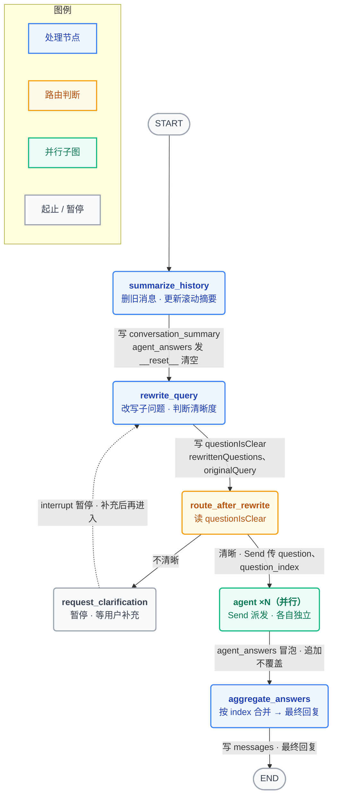
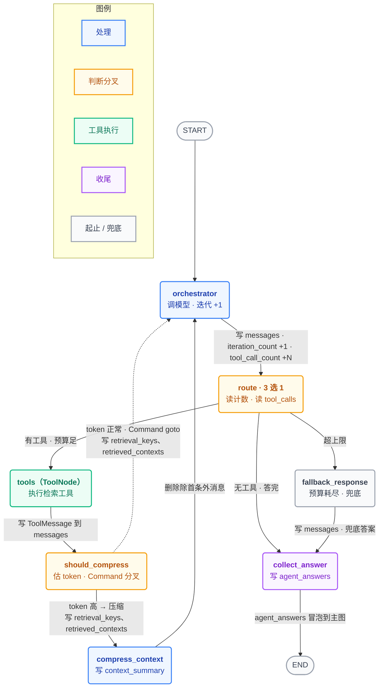
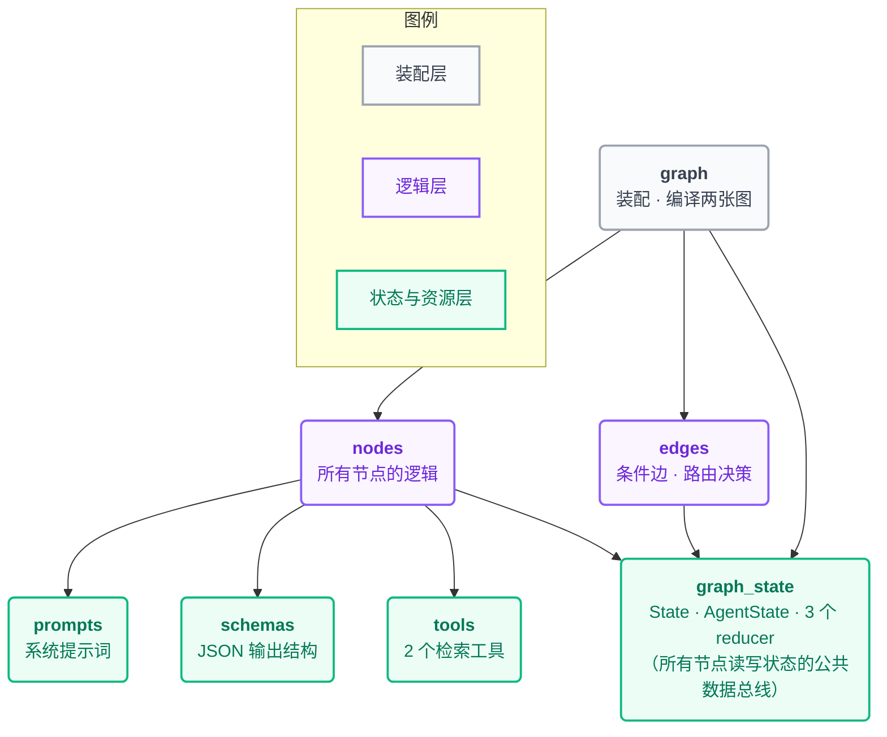

# 多轮 Agentic RAG 企业文档智能问答系统

基于 **LangGraph** 手写「主图 + Agent 子图」双层状态图的多轮 Agentic RAG 系统。模型自主决定检索轮次与检索粒度，支持复合问题并行拆解、澄清追问、上下文压缩与预算护栏。

> 不依赖 `create_react_agent` 等 prebuilt 封装，两张图完全手写，便于精细控制 Agent 的检索循环、上下文工程与容错逻辑。

---

## ✨ 核心特性

| 特性 | 说明 |
| --- | --- |
| **双层状态图** | 主图管多轮记忆、问题改写与并行分发；Agent 子图实现单个子问题的 ReAct 检索循环 |
| **并行子问题** | 用 `Send` 将改写后的 1~3 个子问题 Fan-out 成独立子图并行检索，Fan-in 汇总合成最终回答 |
| **混合检索** | Qdrant 稠密向量 + FastEmbed BM25 稀疏向量双路召回，HYBRID 模式经 RRF 排序融合 |
| **父子分块** | 子块入向量库保证匹配精度，父块独立存储；命中后按 `parent_id` 二次回取完整父块补全上下文 |
| **上下文工程** | 对话侧滚动摘要 + Agent 侧动态 token 阈值压缩，回注「已搜清单」抑制重复检索 |
| **预算护栏** | 迭代轮数与工具调用次数双上限，超限切入 fallback 节点用已有材料强制作答 |
| **澄清追问** | `interrupt` 实现 Human-in-the-loop，问题不清晰时暂停反问，多轮补充累积后合并重写 |
| **结构化输出** | Pydantic + json_mode，挂三重 `field_validator` 容错校验器，兼容模型不规范输出 |
| **评测就绪** | 检索原文块随答案回传，接入 RAGAS 评测（Faithfulness / ContextRecall / ResponseRelevancy） |

---

## 🧱 技术栈

**LangGraph** · **LangChain** · **Qdrant**（稠密+稀疏混合检索）· **FastEmbed BM25** · **智谱 GLM / Embedding-3** · **Pydantic** · **RAGAS** · **Gradio**

---

## 🗺️ 架构与数据流

> 三张图用 Mermaid 绘制，GitHub 原生支持渲染。箭头文字标注了该步写入/传递的关键状态字段。

### 1. 主图（外层）—— 多轮对话 · 改写 · 并行分发 · 汇总



### 2. Agent 子图（内层）—— 单个子问题的「检索 → 判断 → 再检索 / 作答」循环



> ⚠️ `should_compress` 在 `nodes.py` 里返回的是 `Command(goto=…)`，去向写在节点内部，所以 `graph.py` 里查不到它的出边——上图两条出边（实线去 `compress_context`、虚线回 `orchestrator`）正是这个 `Command` 分叉。

### 3. 文件依赖关系 —— `graph_state` 是所有节点读写的公共数据总线



> 完整的字段级读写对照（谁写 → 谁读 → 用什么 reducer 合并）见 [`数据流转对照表.md`](./数据流转对照表.md)。

---

## 📂 项目结构

```
agentic-rag-cn/
├── project/                  # 核心代码
│   ├── graph.py              # 总装：注册节点、连边、compile 两张图
│   ├── graph_state.py        # 状态模板 State / AgentState + 3 个 reducer
│   ├── nodes.py              # 所有节点的业务逻辑（主图 + 子图）
│   ├── edges.py              # 两个条件边（路由决策）
│   ├── tools.py              # 2 个检索工具（搜子块 / 取父块）
│   ├── schemas.py            # 结构化输出的数据模型（Pydantic）
│   └── prompts.py            # 系统提示词
├── markdown_docs/            # 待入库的示例文档
├── 图示/                     # 架构图 / 截图
├── 数据流转对照表.md          # 字段级数据流转文档（配合三张图看）
├── 运行与自检指南.md          # 运行步骤与自检清单
├── check_syntax.py           # 语法自检脚本
├── requirements.txt          # 依赖
└── LICENSE                   # MIT
```

---

## 🚀 快速开始

### 1. 安装依赖

```bash
git clone https://github.com/LiJiatuhly/agentic-rag-cn.git
cd agentic-rag-cn
pip install -r requirements.txt
```

### 2. 配置环境变量

在项目根目录创建 `.env`（或按 `config.py` 的约定配置）：

```bash
ZHIPUAI_API_KEY=你的智谱API Key
```

### 3. 文档入库

将待检索的 PDF / Markdown 放入 `markdown_docs/`，运行入库脚本，将文档切分为父子块并写入 Qdrant。

### 4. 启动问答

启动 Gradio 界面后，在浏览器打开 `http://127.0.0.1:7860` 开始多轮问答。

> 详细运行步骤与自检清单见 [`运行与自检指南.md`](./运行与自检指南.md)。

---

## 🔍 检索设计：两阶段 + 混合

```
用户问题
  → search_child_chunks：稠密 + BM25 双路召回子块，RRF 融合，阈值过滤
  → 命中子块带 parent_id
  → retrieve_parent_chunks：按 parent_id 回取完整父块，补全上下文
  → 模型基于父块作答
```

- **子块**：小片段，入 Qdrant，保证向量匹配精度
- **父块**：大段原文，独立存储，避免大文本挤占向量库
- **混合检索**：稠密向量抓语义相似、BM25 抓关键词精确匹配，RRF 融合两路排名

---

## 🧠 上下文工程

系统对「对话记忆」与「检索记忆」分层管理：

| 层级 | 机制 |
| --- | --- |
| **对话侧**（主图） | 滚动摘要：保留最近 N 轮真实对话，更早消息压缩进 `conversation_summary` 后物理删除 |
| **Agent 侧**（子图） | 动态阈值压缩：以「基础阈值 + 摘要长度 × 增长因子」为动态上限估算 token，超限则把检索历史压成摘要，并在摘要末尾附加「已搜关键词 / 已取父块 ID」清单回注模型，抑制重复检索 |
| **预算护栏** | 迭代轮数（`MAX_ITERATIONS`）与工具调用次数（`MAX_TOOL_CALLS`）双上限，任一超限即切入 fallback 节点用已有材料强制作答 |

---

## 📊 评测

检索链路中的原文块经去重后随答案回传，作为 RAGAS 评测的 `contexts` 输入：

- **检索侧**：ContextRecall —— 评估召回完整性
- **生成侧**：Faithfulness / ResponseRelevancy —— 评估答案对检索内容的忠实度与相关性

---

## 📄 License

[MIT](./LICENSE)
