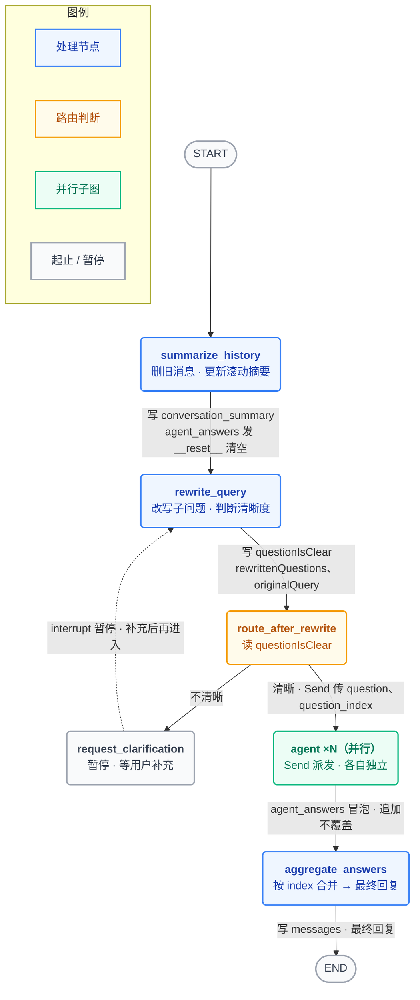
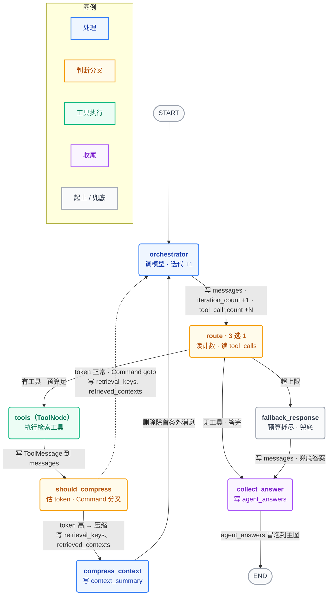
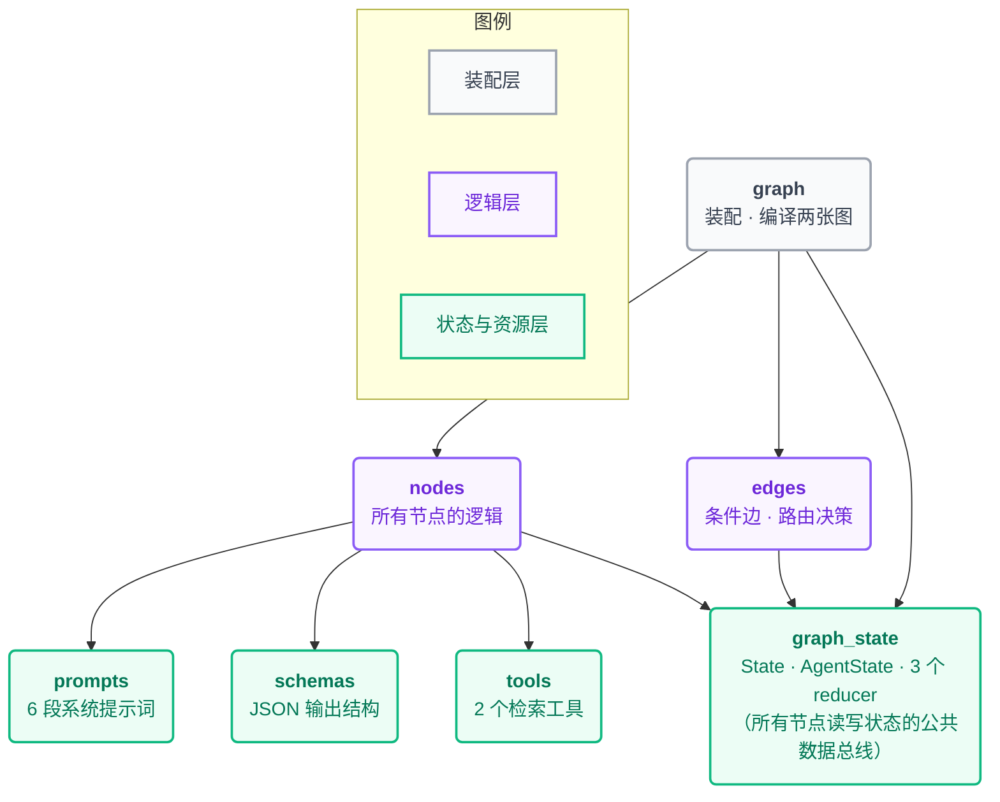

# 数据流转对照表

> **这份文档回答三个问题，按顺序读：**
>
> | 读法 | 看哪一节 | 回答什么 |
> |---|---|---|
> | **① 为什么长成这样** | [〇 · 演进史与疤痕地图](#evolution) | **每个字段都是一次翻车的墓碑。** 不读这节，后面全是死记硬背 |
> | **② 谁连着谁** | [一 · 流程图](#charts)、[二](#main-nodes)[三 · 节点表](#agent-nodes) | 节点怎么连、每条边流转哪个字段 |
> | **③ 这个字段到底装着什么** | [五 · 🔢 数据样例速查表](#samples) | 读到一半忘了某个字段装什么 → **翻这一张** |
>
> （`reducer` = 并行/多次写入同一字段时的合并规则；"无" = 直接覆盖，谁后写谁生效。）
> 配合 `graph_state.py` 里每个字段的【写】【读】【🔢】三段式标注一起看。

---

## 目录

- [〇、这个项目是怎么长出来的（演进史 + 疤痕地图）](#evolution)
- [一、流程图（数据流转版）](#charts)
- [二、主图节点数据流](#main-nodes)
- [三、Agent 子图节点数据流](#agent-nodes)
- [四、状态字段：谁写 → 谁读 → 怎么合并 → 诞生于哪次翻车](#fields)
- [五、🔢 数据样例速查表（每个字段真实长什么样）](#samples)
- [六、四条「隐形数据流」](#hidden)
- [七、这个项目还差什么（从 1 到 100）](#todo)

---

<a id="evolution"></a>
## 〇、这个项目是怎么长出来的（演进史 + 疤痕地图）

> ⚠️ **免责声明**：下面是**代码考古的重建推断**，不是作者真实的 git log。
> 但代码里每一处"看起来多余"的设计都是一道**疤**——**疤是不会骗人的**。

### 核心心法

> ### **每一个状态字段，都是一次翻车的墓碑。**
> 你在 `graph_state.py` 里看到的 `retrieval_keys`、`context_summary`、`pendingQuery`——
> **没有一个是设计出来的，全是撞出来的。**

⚠️ **最重要的一条**：作者**不是**从 LangGraph 开始写的。
**LangGraph 是后来那个 `while` 循环管不住了，才被迫引入的。**

### 演进史：从 20 行到现在

| 版本 | 加了什么 | 💥 撞了什么 | 💊 于是诞生了 |
|---|---|---|---|
| **v0.1** | 20 行裸 RAG：搜一次 → 塞给模型 → 拿答案。**没有 LangGraph、没有图、没有 Agent** | 问"住宿和交通能报多少"→ 5 个块**全是住宿** → **只答一半，还不报错** | —— |
| **v0.2** | ⭐⭐ `bind_tools` + `while` 循环 —— **让模型自己决定搜几次**<br/>**这十行 = "Agent" 三个字的全部含义** | 模型不停搜同一个词，**循环 40 圈，烧掉几十块** | `orchestrator` / `tools` / `route` 判断① 的**内核** |
| **v0.3** | 预算上限：`iteration` / `tool_count` 两个计数器 | 一到上限直接 `break`，`messages[-1].content` 是**空字符串** → 用户拿到一片空白 | `iteration_count`、`tool_call_count`<br/>并行后被迫加 `Annotated[int, operator.add]` |
| **v0.4** | 兜底：预算耗尽时用手头材料"尽力答" | —— | `fallback_response` 节点 |
| **v0.5** | **父子块两步检索**：小块搜（embedding 准）、大块读（上下文全） | 模型把同一个 `parent_id` **反复取了 4 次**——它根本不记得搜过什么 | `tools.py` 的两个工具<br/>「`Parent ID / File Name / Content`」**隐形合同** |
| **v0.6** | 给模型记账本：`search::xxx` / `parent::xxx` 写进摘要 | —— | `retrieval_keys` + `set_union`<br/>前缀防撞名 |
| **v0.7** | 💥💥 **Token 爆炸**：5轮 × 5块 × 2000字 = **4 万 token** | **连环引爆 4 个坑**（见下） | `context_summary`、`should_compress_context`、`TOKEN_GROWTH_FACTOR`、`retrieved_contexts`、`Command(goto=)` |
| **v0.8** | 拆子问题 + `Send` 并行 | ① 答案**互相覆盖**<br/>② 顺序**乱的**<br/>③ 上轮答案**没清干净** | ① `accumulate_or_reset`<br/>② `question_index`<br/>③ `__reset__` 暗号卡 |
| **v0.9** | 澄清机制：不清晰就**问回去** | interrupt 一暂停，`invoke()` 就返回了 → **原问题丢了** | `pendingQuery` + `pendingClarifications`<br/>（"自己写、下一轮自己读"的跨暂停字段） |
| **v0.10** | —— | 智谱 `json_mode` **不听话**：`is_clear` 返回字符串 `"true"` → pydantic 类型报错 → **整个图崩掉** | `schemas.py` 里三个 `@field_validator(mode="before")` |
| **v0.11** | 多轮对话 | 历史爆炸 | `summarize_history` + 滚动摘要 |
| **v0.12** | —— | 💥 **最阴的一个**：并行子图的 `messages`（"我要调工具"+一堆原文）**默认会流回主图**，被当成真实对话摘要成一坨垃圾 | `_name_internal_message` + `_is_plain_conversation_message` |

### 💥 v0.7 的连环坑（全项目最绕的一坨代码，全诞生于此）

一个补丁（"太长了就压缩，把原文删掉"），连环引爆四个新问题：

| # | 连环坑 | 💊 于是诞生了 |
|---|---|---|
| ① | **什么时候压？** 不能每轮都压（每压一次 = 多花一次模型钱） | `should_compress_context` + `estimate_context_tokens` |
| ② | **压缩阈值死循环**：固定阈值 6000 → 压完摘要占 2000 → 下轮又超 → 又压 → **永远在压** | `TOKEN_GROWTH_FACTOR`：`上限 = 基线 + 摘要token × 比例`（**摘要越大，允许上限越高**） |
| ③ | ⭐ **评测要的原文被烧光了**：`RemoveMessage` 删得一干二净，可 RAGAS 需要"模型看到了哪些原文" | `retrieved_contexts` + `append_unique`<br/>**这个 reducer 存在的唯一理由，就是为了抵消 `compress_context` 的副作用** |
| ④ | **一个节点既要改状态、又要决定去哪**：`add_edge` 只能连死边 | 被迫用 `Command(update=, goto=)`<br/>⚠️ **于是 `graph.py` 里永远搜不到 `should_compress_context` 的出边**——这个把所有人看懵的坑，就是这里种下的 |

### 🗺️ 疤痕地图：每个字段 ← 哪次翻车

| 状态字段 / 机制 | 它是哪次翻车的墓碑 |
|---|---|
| `iteration_count` / `tool_call_count` | 模型死循环，烧钱 |
| `Annotated[int, operator.add]` | 并行后两个 Agent 各自 +1，直接覆盖会永远停在 1 → **无限循环** |
| `fallback_response` | 预算耗尽直接 break → 用户拿到空字符串 |
| **父子块两步检索** | 小块没上下文 vs 大块 embedding 被稀释，**二选一都是死** |
| `retrieval_keys` + `set_union` | 模型重复取同一个父块 4 次 |
| `parent::` / `search::` 前缀 | 父块ID 和 搜索词 **撞名** → 静默出错 |
| `context_summary` | token 爆到 4 万 |
| `TOKEN_GROWTH_FACTOR` | 固定阈值 → **压缩死循环** |
| `retrieved_contexts` + `append_unique` | ⭐ 压缩把评测要的原文**烧光了** |
| `Command(goto=)` | 一个节点既要改状态又要选路 |
| `agent_answers` + `accumulate_or_reset` | 并行答案**互相覆盖** |
| `question_index` | 并行答案**顺序乱** |
| `__reset__` 暗号卡 | 上一轮答案**没清干净** |
| `pendingQuery` / `pendingClarifications` | interrupt 暂停后**原问题丢了** |
| 三个 `@field_validator` | 国产模型 `json_mode` 不听话，返回类型不对 |
| `_name_internal_message` | 子图消息**污染主图对话历史** |

### 🔧 想真正学会？别抄代码，按疤痕顺序自己撞一遍

| 步 | 写什么 | **必须亲眼看到** |
|---|---|---|
| 1 | v0.1 的 20 行（**不许用 LangGraph**） | 问双话题问题，**看它答一半** |
| 2 | 加 `bind_tools` + `while` + `print(f"第{i}圈")` | **看它循环 40 圈、反复搜同一个词** |
| 3 | 加预算上限 | 看它第 8 圈停下——**然后看它返回一个空字符串** |
| 4 | 加 `fallback` | 空字符串变成一句像样的答案 ✅ |
| 5 | 塞 5 个 2000 字父块 | **看 token 飙到 4 万** |
| 6 | 加压缩 | **看 RAGAS 拿不到 contexts**（原文被烧了） |
| 7 | ……**然后才**引入 LangGraph | 因为你的 `while` 已经乱得管不动了 |

> ⭐ **`Annotated` 那张纸条、`Command` 那个怪东西、`append_unique` 那个 reducer——
> 你现在能背下来，但只有在第 5 步亲眼看到 token 飙到 4 万的那一刻，它们才真正长进你脑子里。**

---

<a id="charts"></a>
## 一、流程图（数据流转版）

> 三张图用 Mermaid 绘制，在任何支持 Mermaid 的查看器（GitHub、VS Code、Typora、Obsidian 等）里
> 都会渲染成带配色的流程图；**箭头文字标注了该步写入/传递的关键状态字段**。

### 主图（外层）——多轮对话 · 改写 · 并行分发 · 汇总



> **这张图最该看的是哪一处**：`RT --> AG` 那条边上的 `Send`。
> 它是 fan-out 的源头——`rewrittenQuestions` 里有几个子问题，就同时启动几个 `agent` 实例。
> 而 `AG --> AA` 那条是 fan-in（`graph.py` 里写成 `add_edge(["agent"], ...)`，**注意那对方括号**）。
> **少了那对方括号，第一个 Agent 一跑完就走人，另一个的答案还没冒泡上来 → 回复缺一半。**

### Agent 子图（内层）——单个子问题的「检索 → 判断 → 再检索 / 作答」循环



> ⚠️ `should_compress` 在 `nodes.py` 里返回的是 `Command(goto=…)`，去向写在节点内部，
> 所以 **`graph.py` 里查不到它的出边**——上图两条出边（实线去 `compress_context`、虚线回 `orchestrator`）
> 正是这个 `Command` 分叉。（**这个坑的由来见 [v0.7 连环坑 ④](#evolution)**）
>
> **这张图最该看的是哪一处**：`OR → RT → TL → SC → OR` 这个环。
> **⭐ 这个环，就是 v0.2 那十行 `while` 循环搬家搬到 LangGraph 上的样子。** 一模一样的东西。

### 七个文件的依赖关系——`graph_state` 是所有节点读写的公共数据总线



> 箭头方向 = 「装配/使用」指向「被使用」。底部的 `graph_state` 是公共数据总线：每个节点都往里
> 写字段、从里读字段。`tools` 在运行时由 `graph.py` 用 `ToolNode` 接进图里，被 `nodes.py` 的
> `orchestrator` 调用。

---

<a id="main-nodes"></a>
## 二、主图节点数据流

| 节点（所在文件） | 类型 | 读取的字段 | 写入的字段 | 下一步去向 |
| --- | --- | --- | --- | --- |
| `summarize_history`（nodes） | 节点 | `messages`、`conversation_summary` | `conversation_summary`（新摘要）；`messages`（删旧消息）；`agent_answers`=`[{__reset__}]`（清空上轮） | → `rewrite_query` |
| `rewrite_query`（nodes） | 节点 | `messages`、`conversation_summary`、`pendingQuery`、`pendingClarifications` | `questionIsClear`、`rewrittenQuestions`、`originalQuery`、`pendingQuery`、`pendingClarifications`、`messages`（澄清消息打标记） | → 条件边 |
| `route_after_rewrite`（edges） | 条件边 | `questionIsClear`、`rewrittenQuestions` | —（只做路由，不写状态） | 清晰 → 对每个子问题发一个 `Send` 启动 `agent`；不清晰 → `request_clarification` |
| `request_clarification`（nodes） | 节点（interrupt 暂停点） | — | —（返回 `{}`） | 暂停等用户补充 → 回 `rewrite_query` |
| `agent`（子图，×N 并行） | 子图节点 | 由 `Send` 传入 `question`、`question_index` | `agent_answers`（子图结果冒泡上来） | 全部实例跑完（fan-in）→ `aggregate_answers` |
| `aggregate_answers`（nodes） | 节点 | `agent_answers`、`originalQuery`、`messages` | `messages`（最终回复 + 删旧消息） | → END |

⚠️ **`request_clarification` 是个空函数**（`return {}`）。它什么都不干——**它只是一块"路障牌"**，
用来给 `graph.py` 里的 `interrupt_before=["request_clarification"]` 一个可以停靠的名字。

---

<a id="agent-nodes"></a>
## 三、Agent 子图节点数据流

| 节点（所在文件） | 类型 | 读取的字段 | 写入的字段 | 下一步去向 |
| --- | --- | --- | --- | --- |
| `orchestrator`（nodes） | 节点 | `messages`、`question`、`context_summary` | `messages`（问题+模型回复）；`tool_call_count`（**+本轮工具数**）；`iteration_count`（**+1**） | → 条件边 |
| `route_after_orchestrator_call`（edges） | 条件边 | `iteration_count`、`tool_call_count`、末条消息的 `tool_calls` | —（只做路由） | 有工具且预算足 → `tools`；无工具（答完） → `collect_answer`；超 `MAX_*` 上限 → `fallback_response` |
| `tools`（= `ToolNode`，在 graph 组装） | 内置节点 | 末条 `AIMessage.tool_calls` | `messages`（写入 `ToolMessage` 检索结果） | → `should_compress_context` |
| `should_compress_context`（nodes） | 节点（**返回 `Command`**） | `messages`、`retrieval_keys`、`context_summary` | `retrieval_keys`（并入本轮 `search::`/`parent::`）；`retrieved_contexts`（抽检索原文） | **`goto`**：token 超上限 → `compress_context`；否则 → `orchestrator`<br/>⚠️ **`graph.py` 里没有它的出边** |
| `compress_context`（nodes） | 节点 | `messages`、`context_summary`、`question`、`retrieval_keys` | `context_summary`（新摘要 + 已执行清单）；`messages`（**删除除首条外全部**） | → `orchestrator` |
| `fallback_response`（nodes） | 节点 | `messages`、`context_summary`、`question` | `messages`（兜底答案） | → `collect_answer` |
| `collect_answer`（nodes） | 节点 | 末条 `AIMessage`、`question`、`question_index`、`retrieved_contexts` | `final_answer`；`agent_answers`=`[{index, question, answer, contexts}]` | → END（`agent_answers` **冒泡到主图**） |

⚠️ **`orchestrator` 返回的是「增量」，不是「新总数」**：
```python
return {"iteration_count": 1}              # ✅ "我这圈 +1"，框架靠 operator.add 自己去加
return {"iteration_count": iteration + 1}  # ❌ 不用你算
```

⚠️ **`route_after_orchestrator_call` 为什么是 `tool_count > MAX` 而不是 `>=`？**
因为 `orchestrator` 已经把**本轮要调的工具**算进去了。`>` 的意思是"如果真去执行这一轮就会超预算"→ 现在拦住。
写成 `>=` 会**提前一轮**刹车，白白浪费一次检索机会。

---

<a id="fields"></a>
## 四、状态字段：谁写 → 谁读 → 怎么合并 → 诞生于哪次翻车

> 📅 **这是「出场表」**：管的是"谁写谁读、改名要改几处"。
> 想知道**字段里到底装着什么**，看下一节的 [🔢 数据样例速查表](#samples)。

### 主图 `State`

| 字段 | 谁写 | 谁读 | reducer | 💥 诞生于哪次翻车 |
| --- | --- | --- | --- | --- |
| `messages` | chat 入口、`summarize_history`（删）、`rewrite_query`（打标记/澄清）、`aggregate_answers`（最终+删） | `summarize_history`、`rewrite_query`、`aggregate_answers` | `add_messages`（追加 / 按 `RemoveMessage` 删除） | 框架自带 |
| `questionIsClear` | `rewrite_query` | `route_after_rewrite` | 无（覆盖） | v0.9 · 垃圾问题进 → 垃圾答案出 |
| `conversation_summary` | `summarize_history` | `rewrite_query`、`summarize_history` | 无 | v0.11 · 多轮历史爆炸 |
| `originalQuery` | `rewrite_query` | `aggregate_answers` | 无 | v0.8 · 汇总时要知道"用户最初问的是什么" |
| `pendingQuery` | `rewrite_query` | `rewrite_query`（**下一轮自己读**） | 无 | v0.9 · **interrupt 暂停后原问题丢了** |
| `pendingClarifications` | `rewrite_query` | `rewrite_query`（**下一轮自己读**） | 无 | v0.9 · 同上 |
| `rewrittenQuestions` | `rewrite_query` | `route_after_rewrite` | 无 | v0.8 · 一个 Agent 答不全 |
| `agent_answers` | `summarize_history`（`__reset__` 清空）、各子图 `collect_answer`（冒泡追加） | `aggregate_answers` | **`accumulate_or_reset`** | v0.8 · **并行答案互相覆盖** + **上轮答案没清干净** |

### Agent 子图 `AgentState`

| 字段 | 谁写 | 谁读 | reducer | 💥 诞生于哪次翻车 |
| --- | --- | --- | --- | --- |
| `messages` | `orchestrator`、`tools`、`compress_context`（删）、`fallback_response` | `orchestrator`、`route_after_orchestrator_call`、`should_compress_context`、`compress_context`、`fallback_response`、`collect_answer` | `add_messages` | 框架自带 |
| `question` | **`Send`**（派发时传入） | `orchestrator`、`compress_context`、`fallback_response`、`collect_answer` | 无 | v0.8 |
| `question_index` | **`Send`**（派发时传入） | `collect_answer` | 无 | v0.8 · **并行答案顺序乱** |
| `context_summary` | `compress_context` | `orchestrator`、`should_compress_context`、`compress_context`、`fallback_response` | 无 | v0.7 · **token 爆到 4 万** |
| `final_answer` | `collect_answer` | ❗**无人读**（纯留档，删了不影响运行） | 无 | —— |
| `retrieval_keys` | `should_compress_context` | `should_compress_context`、`compress_context` | **`set_union`** | v0.6 · **模型重复取同一个父块 4 次** |
| `retrieved_contexts` | `should_compress_context` | `collect_answer` | **`append_unique`** | v0.7 连环坑③ · **压缩把评测要的原文烧光了** |
| `agent_answers`（子图内） | `collect_answer` | 子图内无人读；**结束时整体冒泡到主图** | **无**（单点写入） | —— |
| `tool_call_count` | `orchestrator`（**每轮 +本轮工具数**） | `route_after_orchestrator_call` | **`operator.add`** | v0.3 · **模型死循环烧钱** |
| `iteration_count` | `orchestrator`（**每轮 +1**） | `route_after_orchestrator_call` | **`operator.add`** | v0.3 · 同上 |

### 🎨 对照实验：撕掉 reducer 那张纸条会怎样

```text
★ agent_answers 有 accumulate_or_reset ★
  Agent0 写 [{"index":0, "answer":"每天上限 500 元。"}]
  Agent1 写 [{"index":1, "answer":"高铁二等座据实报销。"}]
  → 最终 = [两条都在]                                     ✅

☆ 撕掉纸条（普通 List[dict]）☆
  Agent0 写 → 状态 = [{"index":0,...}]
  Agent1 写 → 状态 = [{"index":1,...}]     ← 【覆盖】！
  → 最终 = 只剩交通那条，住宿的没了                        ❌ 而且【不报错】
```

```text
★ iteration_count 有 operator.add ★   逐圈: 1,2,3,4,5,6,7,8 → 第8圈刹车  ✅
☆ 撕掉纸条                        ☆   逐圈: 1,1,1,1,1,1,1,1 → 永远到不了 8 → 💸 无限烧钱 ❌
```

---

<a id="samples"></a>
## 五、🔢 数据样例速查表（每个字段真实长什么样）

> **这是我读到第五个文件、忘了某个字段装什么的时候，唯一要翻回来的一张表。**
> ⚠️ 和上面的「出场表」分工：**出场表管"谁写谁读"，这张表管"它到底是个什么东西"。**
> 函数名 / 类名 / 节点名**不进这张表**。
>
> 🔢 全部样例基于同一个场景：用户问 **"上海出差住宿和交通能报多少"** → 拆成 2 个子问题并行去查。

| 字段 | 一句话它是什么 | 🔢 有值时长什么样 | 🔢 空态 |
|---|---|---|---|
| `agent_answers`<br/>（主图） | N 个并行 Agent 的答案 | `[{"index":1, "question":"上海出差交通费怎么报销", "answer":"高铁二等座据实报销。", "contexts":[...]},`<br/>` {"index":0, "question":"上海出差住宿费报销上限是多少", "answer":"每天上限 500 元。", "contexts":[...]}]`<br/>⚠️ **顺序是乱的**！谁先跑完谁先进 → 必须按 `index` 重排 | `[]`（每轮开头被 `__reset__` 清空） |
| `context_summary` | 检索原文的压缩摘要 | `"已知：上海出差住宿费上限 500 元/天，需正规发票。`<br/>`---`<br/>`**Already executed (do NOT repeat):**`<br/>`Search queries already run:`<br/>`- 上海住宿费报销上限"`<br/>⭐ 末尾那段清单是从 `retrieval_keys` 生成的 | `""`（`compress_context` 还没跑过） |
| `conversation_summary` | 旧对话的滚动摘要 | `"用户在咨询差旅报销规则。已问过：上海住宿费上限500元/天。"` | `""`（第一轮） |
| `final_answer` | 子图答案（**纯留档**） | `"每天上限 500 元。"` ／ `"无法生成答案。"`（异常态兜底） | `""` |
| `iteration_count` | 循环了几圈 | 逐圈：`0 → 1 → 2 → 3`（每圈 **+1**） | `0` |
| `messages`<br/>（主图） | 用户能看到的**真实对话** | `[HumanMessage("上海出差住宿和交通能报多少"),`<br/>` AIMessage("上海出差：住宿每天500元；交通按高铁二等座据实报销。")]`<br/>⭐ **都没有 `name` 属性** = 真实对话的标志 | `[]` |
| `messages`<br/>（子图） | 这个 Agent 的**私人草稿纸** | `[HumanMessage("上海出差住宿费报销上限是多少"),`<br/>` AIMessage(content="", tool_calls=[{"name":"search_child_chunks", "args":{"query":"上海住宿费报销上限"}, "id":"call_abc123"}]),`<br/>` ToolMessage(content="Parent ID: 公司规章制度_p0\nContent: 上海出差住宿费上限500元/天", tool_call_id="call_abc123"),`<br/>` AIMessage("每天上限 500 元。", tool_calls=[])]` | `[]`（被 `Send` 创建时的初始值） |
| `originalQuery` | 用户最初问的完整问题 | `"上海出差住宿和交通能报多少"`<br/>走过澄清：`"报销怎么弄 差旅 住宿费"` | `""` |
| `pendingClarifications` | 用户历次补充的澄清 | `["差旅", "住宿费"]` | `[]`（问清楚了） |
| `pendingQuery` | 暂停时暂存的原问题 | `"报销怎么弄"` | `""`（问清楚了） |
| `question` | 这个 Agent 要答的子问题 | `"上海出差住宿费报销上限是多少"`（0号）<br/>`"上海出差交通费怎么报销"`（1号） | `""` |
| `question_index` | 子问题编号（**排序用**） | `0` ／ `1` | `0` |
| `questionIsClear` | 问题清晰吗 | `True` ← "上海出差住宿和交通能报多少"<br/>`False` ← "报销怎么弄"（太含糊） | `False`（默认按不清晰处理，更保守） |
| `retrieval_keys` | 已搜过的**暗号集合**（防重复） | `{"parent::公司规章制度_p0",`<br/>` "parent::员工手册_p3",`<br/>` "search::上海住宿费报销上限",`<br/>` "search::出差补贴标准"}`<br/>⭐ 前缀防撞名 | `set()` |
| `retrieved_contexts` | 检索原文（**评测用，不发模型**） | `["Parent ID: 公司规章制度_p0\nFile Name: 规章制度.pdf\nContent: 上海出差住宿费上限500元/天",`<br/>` "Parent ID: 公司规章制度_p1\nFile Name: 规章制度.pdf\nContent: 交通费按高铁二等座据实报销"]` | `[]`（没搜到，或全被"暗号"过滤了） |
| `rewrittenQuestions` | 拆分后的子问题列表 | `["上海出差住宿费报销上限是多少",`<br/>` "上海出差交通费怎么报销"]`<br/>⭐ 有几个 → 并行启几个 Agent | `[]` |
| `tool_call_count` | 调了几次工具 | 逐圈：`0 → 1 → 3 → 3`（**+本轮工具数**，第2圈一次调了2个） | `0` |
| `tool_calls`<br/>（AIMessage 上的） | 模型的"我要调工具"清单 | `[{"name":"search_child_chunks", "args":{"query":"上海住宿费报销上限"}, "id":"call_abc123"}]` | `[]`（**模型答完了，不再调工具** → 路由去 `collect_answer`） |

### ⭐ 一问一答：`AIMessage` ↔ `ToolMessage` 必须成对看

模型自己**碰不到向量库**，它只能"说话"：

```
模型说"我要搜"（AIMessage.tool_calls）
    → 框架 ToolNode 真的去执行
        → 结果包成 ToolMessage 塞回 messages

① AIMessage(content="",                              ← 只调工具不说话 → content 是空的
            tool_calls=[{"name": "search_child_chunks",
                         "args": {"query": "上海住宿费报销上限"},
                         "id":   "call_abc123"}])     ← ⭐ 这次调用的唯一编号

② ToolMessage(content="Parent ID: 公司规章制度_p0\nFile Name: 规章制度.pdf\nContent: 上海出差住宿费上限500元/天",
              tool_call_id="call_abc123",            ← ⭐ 和上面的 id 对上
              name="search_child_chunks")
```

💡 **`bind_tools` 让模型能【说】"我要搜"；`ToolNode` 【真的去】搜。两件事，两个对象。**

---

<a id="hidden"></a>
## 六、四条「隐形数据流」

### 1. 子图 `messages` 会流回主图（全项目最隐蔽的一条）

每个并行 `agent` 的 `messages` **默认也会汇回**主图 `State.messages`。

```
子图流回主图的一锅粥：
  [HumanMessage("上海出差住宿和交通能报多少"),                        ← 无 name ✅ 真实对话
   AIMessage(content="", tool_calls=[...], name="agent_response"),  ← 有 name ❌ 子图的
   ToolMessage(content="Parent ID: ...", name="search_child_chunks"),← 有 name ❌ 子图的
   AIMessage("每天上限 500 元。", name="agent_response")]             ← 有 name ❌ 子图的
        │  _is_plain_conversation_message 只留【没有 name】的
        ▼
  [HumanMessage("上海出差住宿和交通能报多少")]                        ← 干净了 ✅
```

**判据只有一条：有没有 `name` 标签。**
`_name_internal_message` 给子图消息打标签，`_is_plain_conversation_message` 把带标签的过滤掉。

⚠️ **`_name_internal_message` 看着像个三行胶水函数（🅲），但它的存在本身，
就反证了"子图消息会流回主图"这个隐形机制。** 这是全项目最该被点名的「伪 🅲 实 🅰️」。

### 2. `agent_answers` 的**两级 reducer**（同名字段，跨边界换规则）

| | 子图 `AgentState.agent_answers` | 主图 `State.agent_answers` |
|---|---|---|
| reducer | **无**（普通 list） | **`accumulate_or_reset`** |
| 为什么 | 子图里只有 `collect_answer` 一个写入点，**不会冲突** → 直接赋值 | N 个子图并行冒泡上来，**必须追加不覆盖** |

⭐ **同一个名字，冒泡跨过子图边界的那一刻，合并规则就换了。** 这是全项目最精妙的一处设计。

### 3. `tools.py` ↔ `nodes.py` 的「隐形合同」

`tools.py` 两个工具返回的字符串是**固定格式**（`Parent ID / File Name / Content`，多个子块用
`CHILD_CHUNK_SEPARATOR` 拼接）。这串字符串被 `ToolNode` 包成 `ToolMessage` 写进 `messages` 后，
由 `nodes.py` 的 `_retrieval_contexts` 按同样格式**反向解析**出干净的检索原文，随答案冒泡到主图供评测。

几个"**暗号**"返回值——`NO_RELEVANT_CHUNKS` / `NO_PARENT_DOCUMENT` / `RETRIEVAL_ERROR:` /
`PARENT_RETRIEVAL_ERROR:`——会被 `_retrieval_contexts` 的 `ignored_prefixes` 过滤掉。

⚠️ **改了 `tools.py` 里的格式或暗号，就必须同步改 `nodes._retrieval_contexts`，否则解析错乱。**

### 4. `__reset__` 暗号卡的「隐形合同」

`summarize_history` 发的 `[{'__reset__': True}]`，字符串键必须和
`accumulate_or_reset` 里的 `item.get('__reset__')` **逐字一致**。

⚠️ 改了其中一处 → 清空卡失效 → **上一轮答案永远清不掉，而且不报错**（静默出错，最难查）。

---

<a id="todo"></a>
## 七、这个项目还差什么（从 1 到 100）

**这份代码停在了 v1.0——一个「能跑但没人能用」的状态。**
证据就在代码里，作者自己留了五张字条：

| 代码里的伏笔 | 它在等什么 |
|---|---|
| `InMemorySaver()` + 注释「进程重启后消失」 | **换 `PostgresSaver`** —— 服务重启不丢对话历史 |
| `config = {"configurable": {"thread_id": "user_123"}}` | **接 FastAPI** —— 多用户会话隔离 |
| `retrieved_contexts`「评测用，不发给模型」 | **接 RAGAS** —— 算召回率 |
| `MAX_TOOL_CALLS` / `MAX_ITERATIONS` | **接成本监控** —— LangSmith / Langfuse |
| 全套 `invoke`（同步版） | **换成 `ainvoke`** —— 接异步 Web，不阻塞事件循环 |

> **"到 100"不是再学一个 Agent 框架，是把这五张字条一张张兑现掉。**