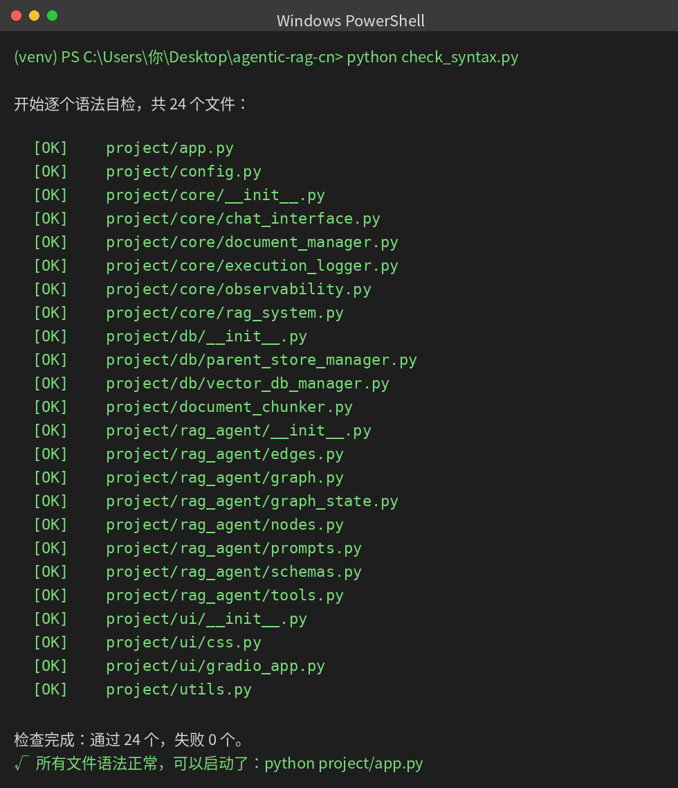
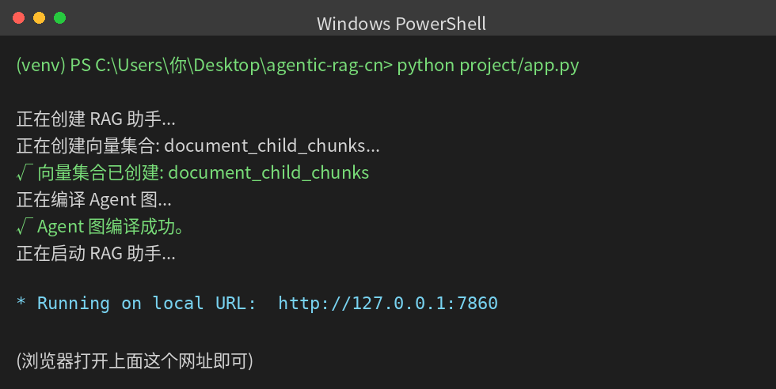

# 运行与自检指南（从虚拟环境到启动）

这份指南专门讲：**激活虚拟环境 → 逐个自检文件语法 → 启动**。里面的终端截图是真实运行截下来的。

---

## 先搞清楚一件事：Python 不用手动"编译"

你可能以为要像 C / Java 那样，先把每个文件一个个编译好，再运行。**Python 不是这样的**：

- Python 是**解释型**语言，你不需要手动编译。
- 你也**不需要一个一个去启动文件**。整个项目只有**一个入口** `project/app.py`，运行它时，它会自动把其它文件（config、rag_agent、db、core、ui……）作为模块加载进来。

那"编译"还有什么用？——**只做一件事：提前检查每个文件有没有语法错误**（比如少写了冒号、括号不匹配）。这一步叫"语法自检"，是**可选的**，但在正式启动前跑一下能让你安心：先确认所有文件都没写错，再启动。

---

## 第一步：激活虚拟环境

在项目根目录 `agentic-rag-cn`（能看到 `requirements.txt` 的那层）打开 PowerShell，然后：

```powershell
venv\Scripts\Activate.ps1
```

- 如果你还没创建过 venv、或还没装依赖，先按主 README（`README_中文.md`）的第④⑤步做一遍。
- 如果报"禁止运行脚本"，先执行 `Set-ExecutionPolicy -Scope Process -ExecutionPolicy Bypass` 再激活。
- 成功的标志：命令行最前面出现绿色的 `(venv)`。**后面每一步都要在有 `(venv)` 的状态下操作。**

---

## 第二步：语法自检（逐个检查每个文件）

我在项目里放了一个傻瓜脚本 `check_syntax.py`，它会**逐个**检查 `project/` 下全部文件的语法。运行：

```powershell
python check_syntax.py
```

### 你会看到这样的结果（真实截图）：



**怎么看这个结果：**

- 每一行 `[OK]  文件名` = 这个文件语法没问题。脚本会把 24 个文件挨个检查一遍。
- 运行成功时，什么错误都不会报，最后显示 `通过 24 个，失败 0 个` 和一行 `所有文件语法正常，可以启动了`。
- **如果某个文件语法有错**，那一行会显示 `[错误]  文件名`，并在下面告诉你错在第几行、什么问题。这时按提示去改那个文件即可。

> 补充：其实 Python 自带一个等效命令 `python -m compileall project` 也能一次性检查整个文件夹，效果一样。`check_syntax.py` 只是把结果显示得更清楚。
>
> 注意：语法自检**只查"有没有写错语法"**，不会真的连接智谱、不花钱。它检查通过 ≠ 一定能跑通（比如 API Key 填错要到启动后才报），但它是启动前最快的一道保险。

---

## 第三步：启动

自检通过后，运行入口文件：

```powershell
python project/app.py
```

### 启动成功时，终端会这样（真实截图）：



**看到最后那行 `Running on local URL:  http://127.0.0.1:7860` 就成功了。** 用浏览器打开 **http://localhost:7860** 就能用了。

- 启动过程中这个 PowerShell 窗口**不要关**，关了服务就停。
- 第一次向它提问，回答可能要等 40~70 秒（模型带推理、一次问答要调好几次），属正常。

---

## 整个流程一句话总结

```
在 agentic-rag-cn 文件夹打开 PowerShell
        │
        ▼
venv\Scripts\Activate.ps1        ← 激活虚拟环境，出现 (venv)
        │
        ▼
python check_syntax.py           ← 逐个自检语法，全 [OK] 才继续（可选）
        │
        ▼
python project/app.py            ← 启动，出现 http://127.0.0.1:7860
        │
        ▼
浏览器打开 http://localhost:7860  ← 开始使用
```

> 各文件分别是干什么的、完整的安装步骤、常见问题排查，见主文档 `README_中文.md`。
